# PROJECT_WORKFLOW.md — Secure Document Management System (SDMS)

> End-to-end workflow documentation covering every major user journey from
> application startup through shutdown, with layer-by-layer detail.

---

## Table of Contents

1. [Application Startup Sequence](#1-application-startup-sequence)
2. [Login Workflow](#2-login-workflow)
3. [Registration Workflow](#3-registration-workflow)
4. [Dashboard Loading](#4-dashboard-loading)
5. [Document Upload Workflow](#5-document-upload-workflow)
6. [Document Listing & Search](#6-document-listing--search)
7. [Document Download Workflow](#7-document-download-workflow)
8. [Document Sharing Workflow](#8-document-sharing-workflow)
9. [Face Enrollment Workflow](#9-face-enrollment-workflow)
10. [Face Login Workflow](#10-face-login-workflow)
11. [Audit Logging Throughout](#11-audit-logging-throughout)
12. [Logout Workflow](#12-logout-workflow)
13. [Complete End-to-End Workflow](#13-complete-end-to-end-workflow)

---

## 1. Application Startup Sequence

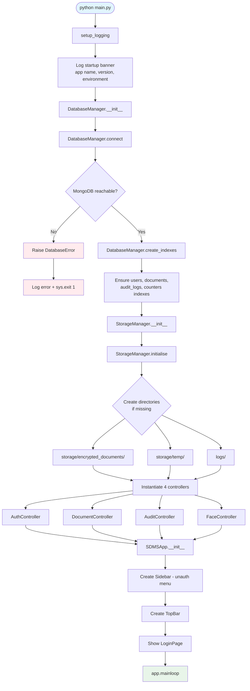

### Layer-by-Layer Detail

| Step | Layer | Component | What Happens |
|------|-------|-----------|-------------|
| 1 | Infrastructure | `main.py` | Entry point; imports are deferred to avoid circular deps |
| 2 | Infrastructure | `logging_config.py` | Root logger configured with file handler (`logs/sdms.log`) and console handler; log level from `.env` |
| 3 | Infrastructure | `DatabaseManager` | Singleton creates `pymongo.MongoClient` with configured URI and timeouts |
| 4 | Infrastructure | `DatabaseManager.create_indexes()` | Creates unique indexes on `user_id`, `username`, `document_id`, `audit_id`; compound indexes on `owner_id`, `timestamp` |
| 5 | Infrastructure | `StorageManager` | Verifies/creates `storage/encrypted_documents/`, `storage/temp/`, `logs/` directories |
| 6 | Infrastructure | `Settings` singleton | Already loaded during import; `.env` values available to all modules |
| 7 | Presentation | `SDMSApp` (CustomTkinter `CTk`) | Main window created; geometry set to screen size; sidebar + topbar + page container laid out in grid |
| 8 | Presentation | `Sidebar` | Builds unauthenticated menu: Login, Register items only |
| 9 | Presentation | `TopBar` | Theme toggle set to light; breadcrumb shows "Login"; user section hidden |
| 10 | Presentation | `LoginPage` | Rendered in page container; username/password fields + Login button + Face Login button + Register link |

---

## 2. Login Workflow

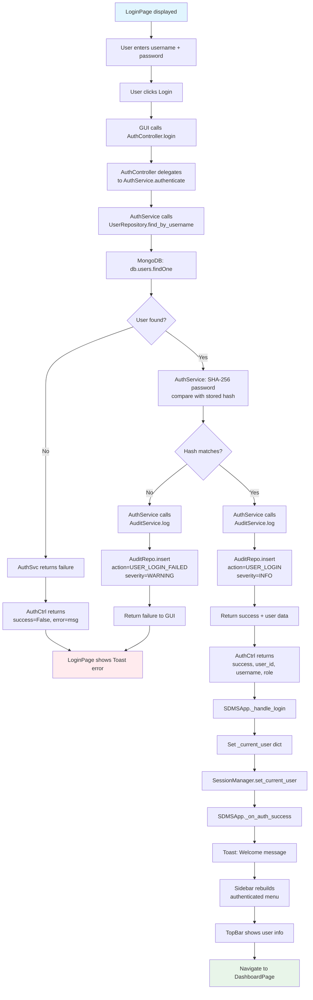

### Password Verification Detail

```python
# AuthService.authenticate() simplified
def authenticate(self, username: str, password: str) -> dict:
    user = self._user_repo.find_by_username(username)
    if user is None:
        return {"success": False, "error": "Invalid credentials"}

    computed_hash = SHA256Hasher.hash(password.encode())
    if computed_hash != user.password_hash:
        self._audit_svc.log(
            action=AuditAction.USER_LOGIN_FAILED,
            user_id=user.user_id,
            severity=SeverityLevel.WARNING,
        )
        return {"success": False, "error": "Invalid credentials"}

    self._audit_svc.log(
        action=AuditAction.USER_LOGIN,
        user_id=user.user_id,
        severity=SeverityLevel.INFO,
    )
    return {
        "success": True,
        "user_id": user.user_id,
        "username": user.username,
        "role": user.role,
    }
```

---

## 3. Registration Workflow

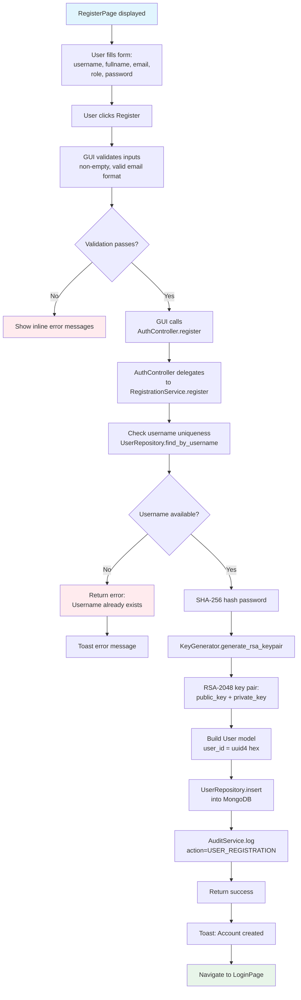

### RSA Key Generation at Registration

```
RegistrationService.register(username, password, role):
    1. password_hash = SHA-256(password)
    2. (public_pem, private_pem) = KeyGenerator.generate_rsa_keypair()
       - Uses PyCryptodome: RSA.generate(2048, e=65537)
       - Exports public key in PEM format
       - Exports private key in PEM format
    3. user = User(
           user_id = uuid4().hex,
           username = username,
           password_hash = password_hash,
           role = role,
           rsa_public_key = public_pem,
           rsa_private_key = private_pem,
           created_at = datetime.now(UTC),
           is_active = True,
       )
    4. user_repo.insert(user)
    5. audit_svc.log(USER_REGISTRATION)
```

---

## 4. Dashboard Loading

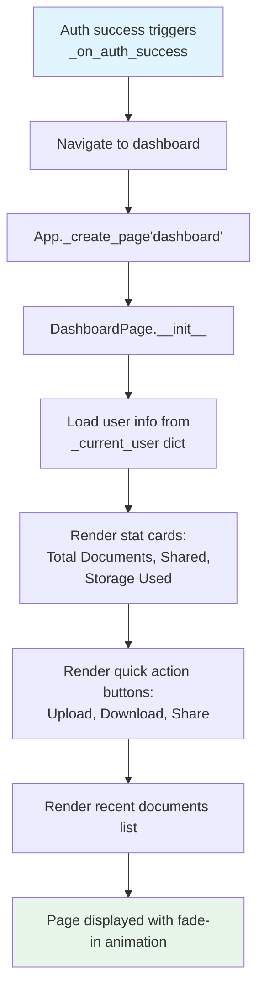

### Dashboard Data Sources

| Widget | Data Source |
|--------|-----------|
| "Welcome, {name}" | `_current_user["full_name"]` |
| Role badge | `_current_user["role"]` |
| Total documents | `DocumentController.list_my_documents()` → count |
| Shared documents | `DocumentController.list_shared_with_me()` → count |
| Recent documents | First 5 from `list_my_documents()` |
| Quick actions | Static buttons linking to upload/download/share pages |

---

## 5. Document Upload Workflow

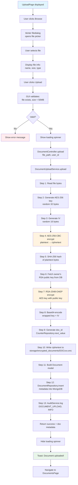

### Encryption Pipeline (Step 4-7 Detail)

```python
# DocumentUploadService.upload() core logic
def upload(self, file_path: str, user_id: str) -> dict:
    # 1. Read plaintext
    with open(file_path, "rb") as f:
        plaintext = f.read()

    # 2-3. Generate AES key and IV
    aes_key = get_random_bytes(32)   # AES-256
    iv = get_random_bytes(16)        # CBC IV

    # 4. Encrypt
    cipher = AESCipher(key=aes_key)
    payload = cipher.encrypt(plaintext)  # EncryptedPayload

    # 5. Hash
    hasher = SHA256Hasher()
    file_hash = hasher.hash(plaintext)

    # 6-7. Wrap AES key
    owner = self._user_repo.find_by_id(user_id)
    rsa = RSACipher()
    wrapped_key = rsa.encrypt(aes_key, owner.rsa_public_key)

    # 8. Encode for storage
    b64_key = Base64Utils.encode(wrapped_key)
    b64_iv = Base64Utils.encode(payload.iv)

    # 9-12. Store
    doc_id = self._id_svc.next_id()
    encrypted_filename = f"{doc_id}.enc"
    storage_path = settings.STORAGE_ENCRYPTED_PATH / encrypted_filename
    storage_path.write_bytes(payload.ciphertext)

    document = Document(
        document_id=doc_id,
        original_filename=os.path.basename(file_path),
        encrypted_filename=encrypted_filename,
        owner_id=user_id,
        encrypted_aes_key=b64_key,
        iv=b64_iv,
        sha256_hash=file_hash,
        file_size=len(plaintext),
        algorithm="AES-256-CBC",
    )
    self._doc_repo.insert(document)
    return {"success": True, "document_id": doc_id}
```

---

## 6. Document Listing & Search

```mermaid
flowchart TD
    A[DocumentsPage displayed] --> B[App._create_page'documents']
    B --> C[DocumentController.list_my_documents]
    C --> D[DocumentListingService.list_user_documents]
    D --> E[DocumentRepository.find_many<br>{owner_id: user_id, is_deleted: false}]
    E --> F[MongoDB: db.documents.find]
    F --> G[Return list of Document models]
    G --> H[Convert to display dicts]
    H --> I[DocumentsPage.load_documents]
    I --> J[Render document cards<br>with name, date, size, actions]

    J --> K{User clicks Search tab}
    K --> L[SearchPage displayed]
    L --> M[User enters search query]
    M --> N[DocumentController.search]
    N --> O[DocumentListingService.search]
    O --> P[DocumentRepository.search<br>regex on filename, owner]
    P --> Q[Return matching documents]
    Q --> R[SearchPage displays results]

    style A fill:#e1f5fe
    style J fill:#e8f5e9
    style R fill:#e8f5e9
```

### Listing Filters

| Filter | MongoDB Query |
|--------|--------------|
| My documents | `{owner_id: user_id, is_deleted: false}` |
| Shared with me | `{shared_with.user_id: user_id, is_deleted: false}` |
| Search by name | `{original_filename: {$regex: query, $options: "i"}}` |
| Search by owner | `{owner_id: {$in: [matching_user_ids]}}` |
| Date range | `{created_at: {$gte: start, $lte: end}}` |

---

## 7. Document Download Workflow

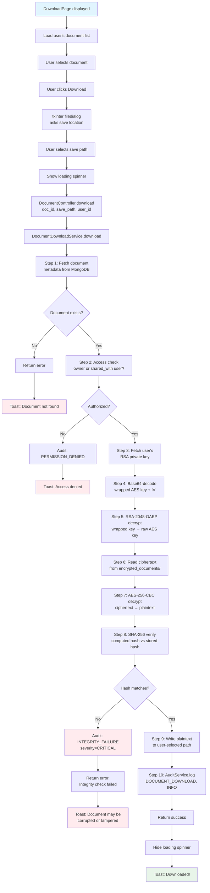

### Integrity Verification Detail

```python
# DocumentDownloadService.download() core logic
def download(self, doc_id: str, save_path: str, user_id: str) -> dict:
    # 1. Fetch document
    document = self._doc_repo.find_by_id(doc_id)
    if document is None:
        return {"success": False, "error": "Document not found"}

    # 2. Access check
    if document.owner_id != user_id:
        shared_entry = next(
            (s for s in document.shared_with if s.user_id == user_id),
            None,
        )
        if shared_entry is None:
            self._audit_svc.log(PERMISSION_DENIED)
            return {"success": False, "error": "Access denied"}
        wrapped_key_b64 = shared_entry.encrypted_aes_key
    else:
        wrapped_key_b64 = document.encrypted_aes_key

    # 3-5. Unwrap AES key
    user = self._user_repo.find_by_id(user_id)
    wrapped_key = Base64Utils.decode(wrapped_key_b64)
    rsa = RSACipher()
    aes_key = rsa.decrypt(wrapped_key, user.rsa_private_key)

    # 6-7. Decrypt file
    encrypted_path = settings.STORAGE_ENCRYPTED_PATH / document.encrypted_filename
    ciphertext = encrypted_path.read_bytes()
    iv = Base64Utils.decode(document.iv)
    aes = AESCipher(key=aes_key)
    payload = EncryptedPayload(ciphertext=ciphertext, iv=iv)
    plaintext = aes.decrypt(payload)

    # 8. Verify integrity
    hasher = SHA256Hasher()
    if not hasher.verify(plaintext, document.sha256_hash):
        self._audit_svc.log(INTEGRITY_FAILURE, severity=CRITICAL)
        return {"success": False, "error": "Integrity check failed"}

    # 9. Write to disk
    with open(save_path, "wb") as f:
        f.write(plaintext)

    # 10. Audit
    self._audit_svc.log(DOCUMENT_DOWNLOAD)
    return {"success": True, "path": save_path}
```

---

## 8. Document Sharing Workflow

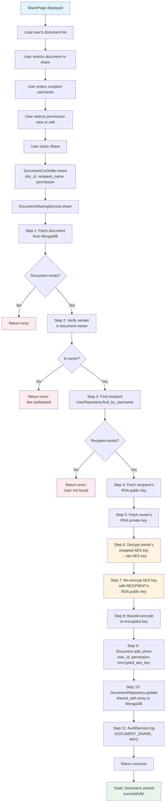

### Key Re-Encryption Flow

```
Original state:
  document.encrypted_aes_key = RSA_owner_pubkey(AES_key)

After sharing with User B:
  document.shared_with[0] = {
    user_id: "B",
    permission: "view",
    encrypted_aes_key: RSA_B_pubkey(AES_key)    ← NEW
  }

After sharing with User C:
  document.shared_with[1] = {
    user_id: "C",
    permission: "edit",
    encrypted_aes_key: RSA_C_pubkey(AES_key)    ← NEW
  }

The file on disk (DOCxxx.enc) is NOT re-encrypted.
Only the key wrapping changes per recipient.
```

---

## 9. Face Enrollment Workflow

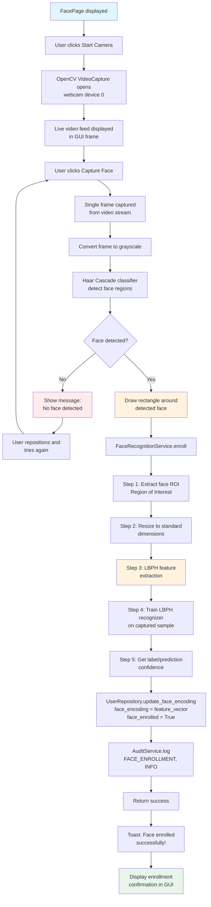

### LBPH Processing Detail

```python
# FaceRecognitionService.enroll() core logic
def enroll(self, user_id: str, username: str) -> dict:
    # 1. Open camera
    cap = cv2.VideoCapture(0)
    ret, frame = cap.read()
    cap.release()

    if not ret:
        return {"success": False, "error": "Camera error"}

    # 2. Convert to grayscale
    gray = cv2.cvtColor(frame, cv2.COLOR_BGR2GRAY)

    # 3. Detect face
    face_cascade = cv2.CascadeClassifier(
        cv2.data.haarcascades + "haarcascade_frontalface_default.xml"
    )
    faces = face_cascade.detectMultiScale(gray, 1.3, 5)

    if len(faces) == 0:
        return {"success": False, "error": "No face detected"}

    # 4. Extract face ROI
    x, y, w, h = faces[0]
    face_roi = gray[y:y+h, x:x+w]

    # 5. Train LBPH recognizer
    recognizer = cv2.face.LBPHFaceRecognizer_create()
    labels = [0]
    recognizer.train([face_roi], np.array(labels))

    # 6. Get feature vector (LBP histogram)
    # The trained model internally computes LBP features
    # which are stored as the face encoding

    # 7. Store in database
    face_encoding = recognizer.getLabels()  # or computed histogram
    self._user_repo.update_face_encoding(
        user_id=user_id,
        face_encoding=face_encoding,
        face_enrolled=True,
    )

    self._audit_svc.log(FACE_ENROLLMENT)
    return {"success": True}
```

---

## 10. Face Login Workflow

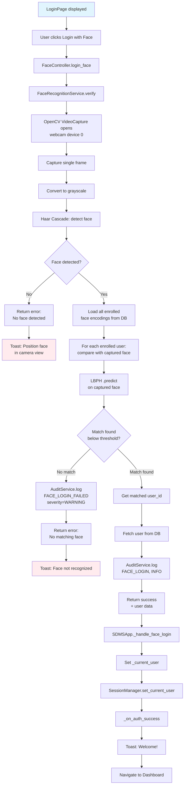

### Face Matching Algorithm

```python
# FaceRecognitionService.verify() core logic
def verify(self) -> dict:
    # 1. Capture frame
    cap = cv2.VideoCapture(0)
    ret, frame = cap.read()
    cap.release()

    if not ret:
        return {"success": False, "error": "Camera error"}

    gray = cv2.cvtColor(frame, cv2.COLOR_BGR2GRAY)

    # 2. Detect face
    faces = self._face_cascade.detectMultiScale(gray, 1.3, 5)
    if len(faces) == 0:
        return {"success": False, "error": "No face detected"}

    x, y, w, h = faces[0]
    face_roi = gray[y:y+h, x:x+w]

    # 3. Load all enrolled users with face encodings
    enrolled_users = self._user_repo.find_enrolled_users()

    best_match = None
    best_confidence = float("inf")

    for user in enrolled_users:
        # 4. Create temporary recognizer with enrolled face
        temp_recognizer = cv2.face.LBPHFaceRecognizer_create()
        enrolled_face = np.array(user.face_encoding, dtype=np.uint8)
        temp_recognizer.train([enrolled_face], np.array([0]))

        # 5. Predict
        label, confidence = temp_recognizer.predict(face_roi)

        # 6. Lower confidence = better match
        if confidence < best_confidence and confidence < THRESHOLD:
            best_confidence = confidence
            best_match = user

    if best_match is None:
        return {"success": False, "error": "No match found"}

    return {
        "success": True,
        "user_id": best_match.user_id,
        "username": best_match.username,
        "role": best_match.role,
    }
```

---

## 11. Audit Logging Throughout

Every significant user action is recorded. Here is the complete audit trail
coverage:

| Workflow | Action Logged | Severity | Trigger Point |
|----------|--------------|----------|---------------|
| Registration | `USER_REGISTRATION` | INFO | After successful DB insert |
| Login | `USER_LOGIN` | INFO | After password verification |
| Failed login | `USER_LOGIN_FAILED` | WARNING | After hash mismatch |
| Logout | `USER_LOGOUT` | INFO | On logout button click |
| Document upload | `DOCUMENT_UPLOAD` | INFO | After file + metadata stored |
| Document download | `DOCUMENT_DOWNLOAD` | INFO | After file written to disk |
| Document share | `DOCUMENT_SHARE` | INFO | After shared_with updated |
| Access denied | `PERMISSION_DENIED` | WARNING | When non-owner tries restricted action |
| Integrity failure | `INTEGRITY_FAILURE` | CRITICAL | When SHA-256 hash doesn't match |
| Face enrollment | `FACE_ENROLLMENT` | INFO | After face encoding stored |
| Face enrollment fail | `FACE_ENROLLMENT_FAILED` | WARNING | When no face detected |
| Face login | `FACE_LOGIN` | INFO | After successful match |
| Face login fail | `FACE_LOGIN_FAILED` | WARNING | When no match found |
| Audit log view | `AUDIT_LOG_VIEW` | INFO | When admin views audit page |
| Unauthorized access | `UNAUTHORIZED_ACCESS` | SECURITY_ALERT | When user accesses restricted resource |

### Audit Log Data Structure

```python
AuditLog(
    audit_id="AUD001",
    timestamp=datetime.now(UTC),
    user_id="a1b2c3...",
    username="john_doe",
    role="admin",
    action="DOCUMENT_UPLOAD",
    resource_type="DOCUMENT",
    resource_id="DOC001",
    resource_name="report.pdf",
    status="SUCCESS",
    message="Document uploaded and encrypted successfully",
    severity="INFO",
    session_id="sess_abc...",
    client_ip="192.168.1.100",
    device_info="Windows-10-Python3.11",
    metadata={"file_size": 1048576, "algorithm": "AES-256-CBC"},
)
```

---

## 12. Logout Workflow

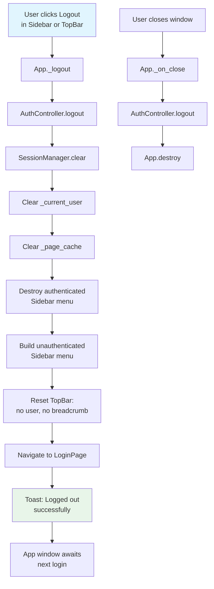

### Session Cleanup

```python
def _logout(self):
    # 1. Service-layer cleanup
    if self.controller:
        self.controller["auth"].logout()   # Clears SessionManager

    # 2. GUI state cleanup
    self._current_user = None
    self._page_cache.clear()

    # 3. Reset UI to pre-auth state
    self._show_login()

    # 4. Inform user
    Toast(self, "Logged out successfully", "info")
```

---

## 13. Complete End-to-End Workflow

The following flowchart shows the entire application lifecycle from startup
through all major operations:

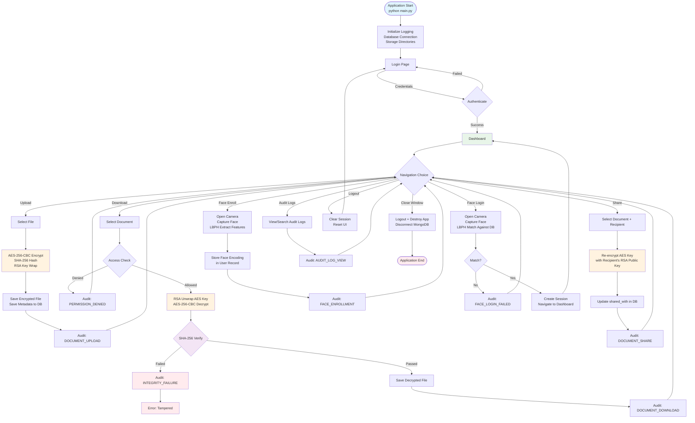

### Lifecycle Summary Table

| Phase | Actions | Data Flows |
|-------|---------|-----------|
| **Startup** | Config → Logging → DB → Storage → GUI | `.env` → Settings → all modules |
| **Auth** | Login/Register → Session → Dashboard | User credentials → SHA-256 → MongoDB → Session |
| **Upload** | File → Encrypt → Hash → Store → Audit | Plaintext → AES → RSA → Disk + MongoDB |
| **List** | Query → Filter → Render | MongoDB → Document models → GUI cards |
| **Download** | Select → Access check → Decrypt → Verify → Save | MongoDB → RSA → AES → SHA-256 → Disk |
| **Share** | Select → Find recipient → Re-encrypt key → Update | Owner key → Recipient pubkey → MongoDB |
| **Face Enroll** | Camera → Detect → LBPH → Store | Webcam → OpenCV → NumPy → MongoDB |
| **Face Login** | Camera → Detect → Match → Session | Webcam → OpenCV → MongoDB → Session |
| **Audit** | Query logs → Filter → Render table | MongoDB → AuditLog models → GUI table |
| **Logout** | Clear session → Reset UI → Show login | Session → None → LoginPage |
| **Shutdown** | Final logout → Destroy window → Disconnect DB | App → MongoDB disconnect → Exit |

---

## Appendix: Request Lifecycle Example

A complete document upload request traverses every layer:

```
User clicks "Upload"
    │
    ▼
┌──────────────────────┐
│   PRESENTATION        │  UploadPage validates input, shows spinner
└──────────┬───────────┘
           │  document_controller.upload(path, user_id)
           ▼
┌──────────────────────┐
│   CONTROLLER          │  DocumentController (thin facade)
└──────────┬───────────┘
           │  document_upload_service.upload(path, user_id)
           ▼
┌──────────────────────┐
│   SERVICE             │  DocumentUploadService (orchestrates crypto + storage)
│                       │  1. Read file
│                       │  2. Generate AES key + IV
│                       │  3. AES encrypt → EncryptedPayload
│                       │  4. SHA-256 hash → hex string
│                       │  5. RSA wrap AES key → bytes
│                       │  6. Base64 encode → strings
│                       │  7. Write ciphertext to disk
│                       │  8. Build Document model
│                       │  9. Insert to DB
│                       │ 10. Log audit entry
└──────────┬───────────┘
           │  crypto modules + repositories
           ▼
┌──────────────────────┐
│   DATA ACCESS         │  DocumentRepository.insert(document.to_dict())
└──────────┬───────────┘
           │
           ▼
┌──────────────────────┐
│   INFRASTRUCTURE      │  MongoDB insert / File I/O / AES / RSA / SHA-256
└──────────────────────┘
```

Every operation in SDMS follows this same layered traversal, ensuring clear
separation of concerns, testability at each layer, and maintainability.
